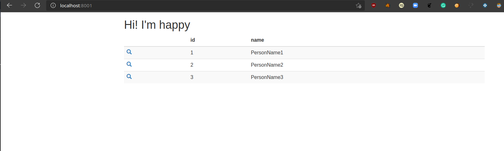

# Sample PHP SQL Docker Application

I took a PHP (8.0 version) and mysql (8.0 version) application, which displays simple data table fetches from mysql DB in the browser on port 8001.

I took `docker-compose` technology for easy management of the application env level changes by passing different env sets using --env-file.

I tool `ansible-vault` as an secrets manager for storing and passing env level secrets as key-value pairs
<br><br/>
<br><br/>


## Application Deployment on local environment

**pre-requisities**
1. docker runtime
2. docker compose

**Application deployment**
* Clone github repo
	```shell
	git clone https://github.com/THIRTHAPRASAD/rackspace-assignment.git
	```

* Deploying appication and db containers
    1. for stage environment
    ```shell
    	cd lamp-app/
	docker-compose build && docker-compose --env-file .env-stage up -d
    ```
    2. for prod environment
    ```shell
	cd lamp-app/
    	docker-compose build && docker-compose --env-file .env-prod up -d
    ```
## Application Deployment on AWS environment

**pre-requisities**
1. AWS account
2. AWS IAM user 
3. terraform
4. ansible

* **Clone github repo**
	```shell
	git clone https://github.com/THIRTHAPRASAD/rackspace-assignment.git
	```

* **build infra**
    ```shell
    cd terraform
    terraform init
    terraform plan
    terraform apply
    ```

* **deploying application using ansible on aws infra**
    1. prepare hosts file with by listing the instance IP address and key file
        ```shell
	cd anible/
        vi hosts
        ```
        then add the instance details as below format
        ```shell
        [all]     # list the IP/DNS addresses of the VMs to deploy VM Enforcer
        10.0.0.1       ansible_ssh_private_key_file=~/.ssh/test-key    ansible_user=test-user
        10.0.0.x       ansible_ssh_private_key_file=~/.ssh/test-key
        test.rackspace.com  ansible_user=test-user
        ```
    2. deploy application on the hosts
        ```shell
        ansible-playbook lamp-app.yaml -i hosts -e env=prod --vault-password-file pass -vv
        ```

    3. (optional) edit DB values
        ```shell
        ansible-vault edit vars/prod-vault.yaml
        ```
        enter password `rack` and the edit the values and save the file
